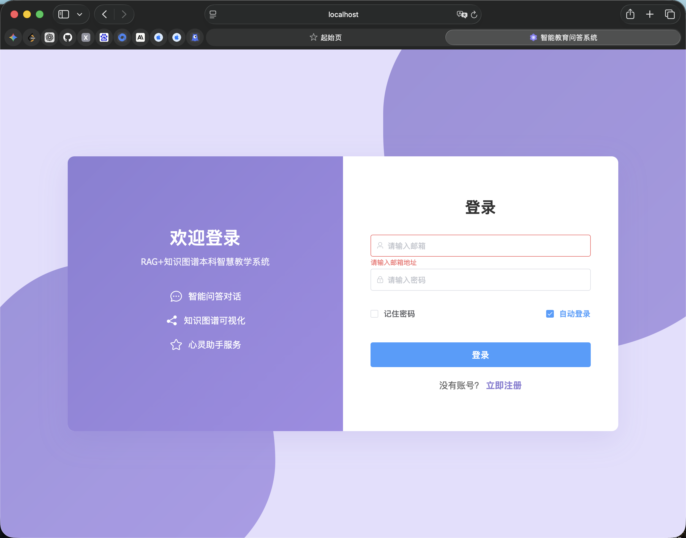
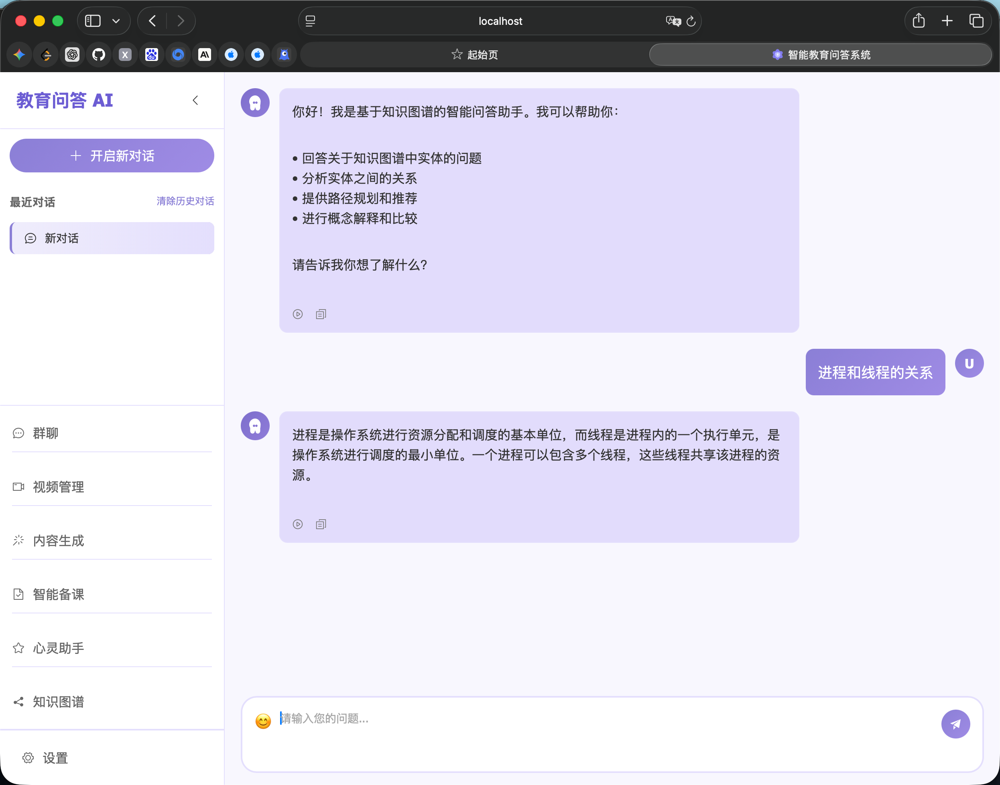
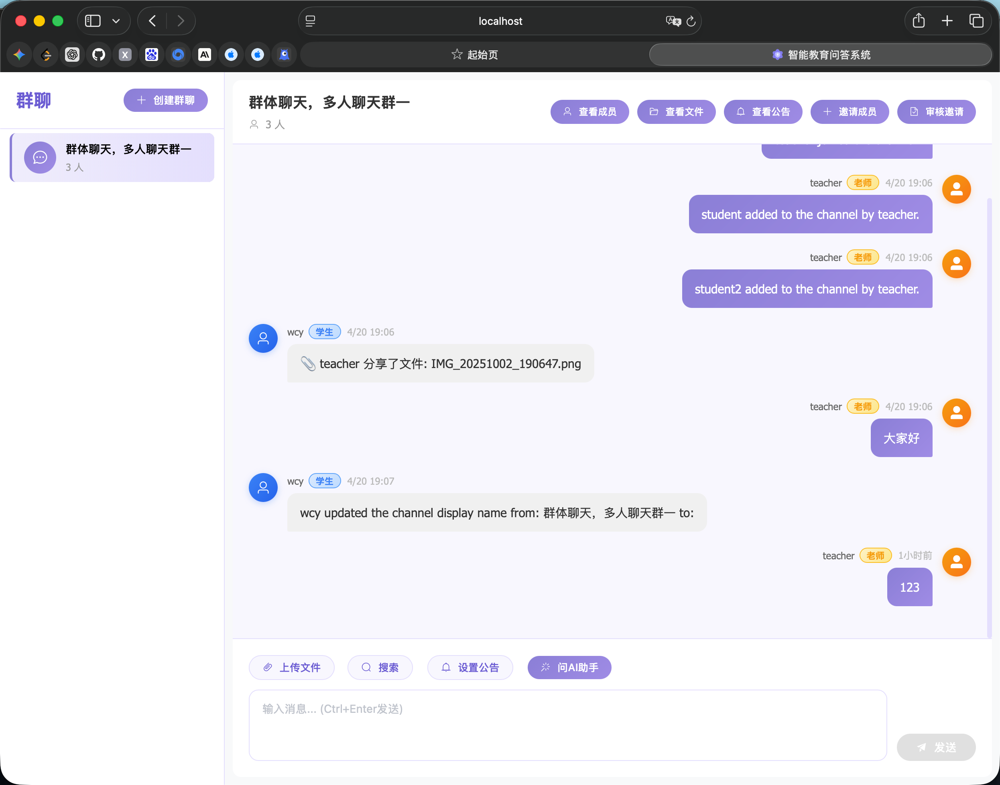
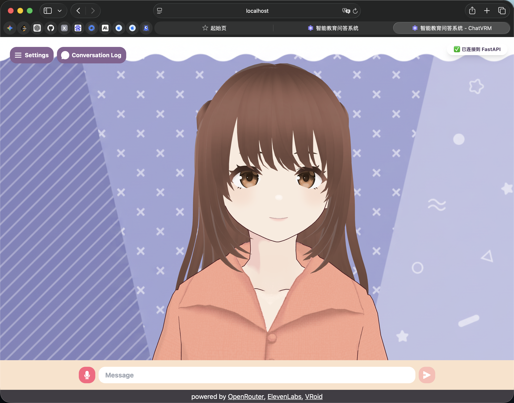
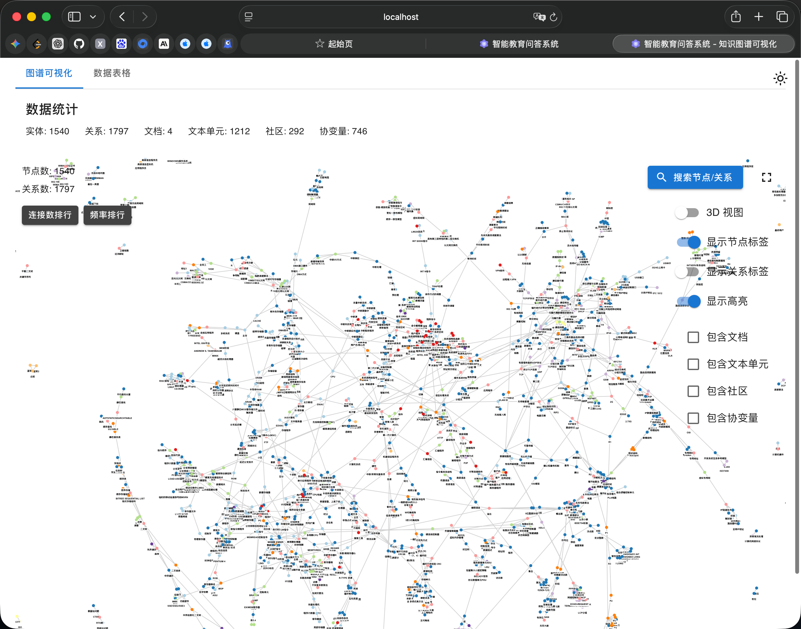
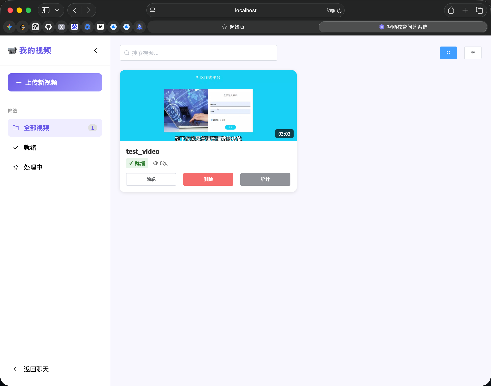
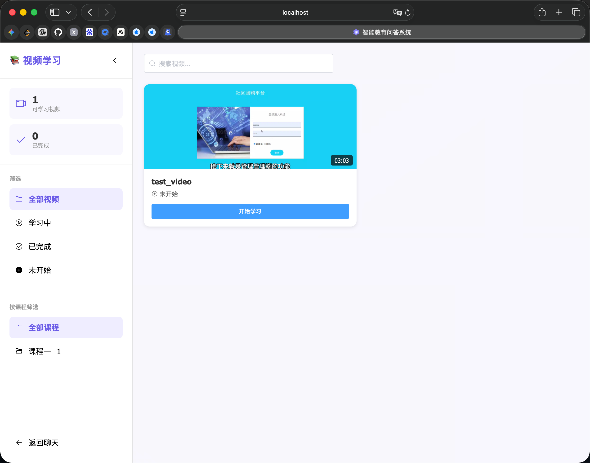
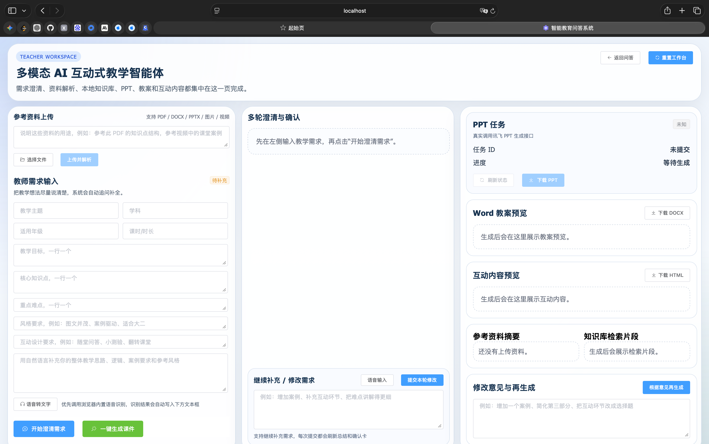
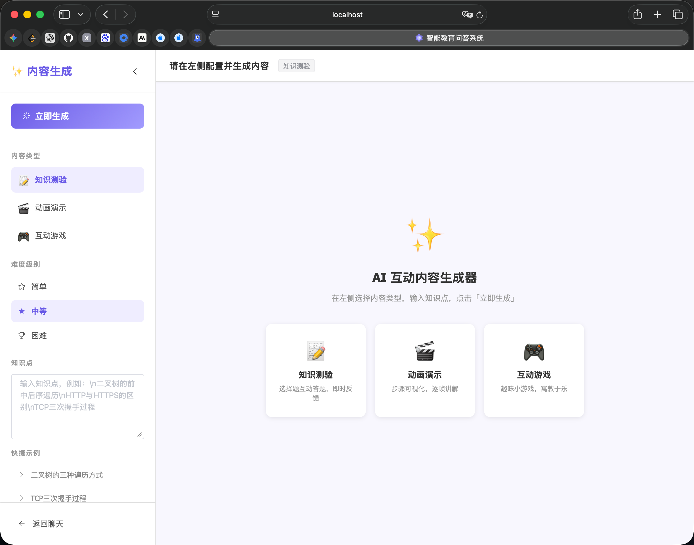
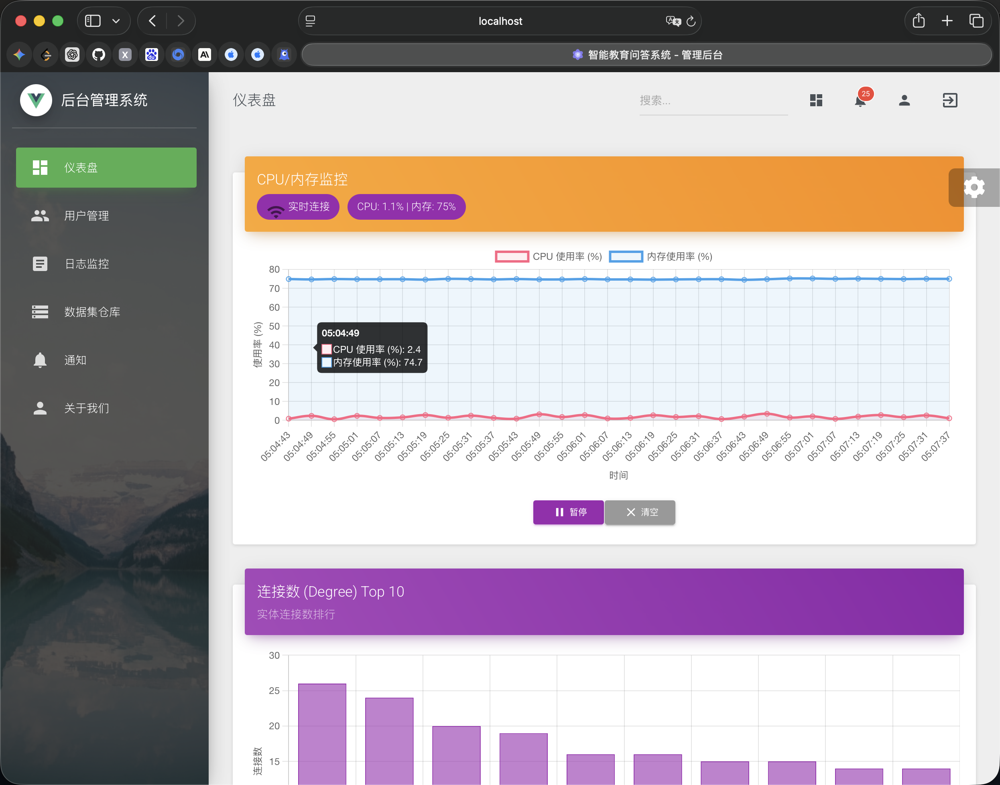

# Education AI Platform

一个面向学生自用和教学实验场景的 AI 教育平台，覆盖学生学习、教师备课、知识图谱分析和后台管理等完整流程。平台包含 AI 学业问答、GraphRAG 知识图谱、群聊协作、心理陪伴、课程视频学习、内容生成、教师智能备课和管理后台等模块。项目后端基于 FastAPI、Tortoise ORM、MySQL、Redis、Neo4j、Qdrant、LangChain/LangGraph 构建；前端包含 Vue 学生端、Vue 管理端、React GraphRAG 可视化端和 Next.js 虚拟陪伴端；AI 能力主要接入 DashScope/Qwen、CosyVoice、ChatTTS、Vosk，并通过 Docker Compose 编排完整本地运行环境。

> 本项目由桂林电子科技大学三名研究生制作完成：2028 届韦草原、杨文军，2026 届洪基恒。

## 目录

- [核心功能](#核心功能)
- [技术栈](#技术栈)
- [页面说明](#页面说明)
- [项目结构](#项目结构)
- [部署流程](#部署流程)
- [环境变量说明](#环境变量说明)
- [常用服务地址](#常用服务地址)
- [本地模型与大文件说明](#本地模型与大文件说明)
- [常见问题](#常见问题)

## 核心功能

本平台围绕“学生学习 + 教师备课 + 知识辅助 + 系统管理”构建。学生端支持账号注册登录、AI 学业问答、问答历史、语音播报、群聊学习协作、心理陪伴入口、GraphRAG 知识图谱查看、教学视频学习和学习内容生成；教师端支持课程视频上传与管理、教学内容生成、参考资料上传、意图识别、教案生成、互动内容生成、PPT 任务生成和面向教师的智能备课流程；管理端提供用户、日志、通知、数据集、统计图表和系统状态查看。系统侧提供基于 Neo4j 的知识图谱、基于 Qdrant 的语义缓存/向量检索、基于 Redis 的异步任务和实时消息、基于 MySQL 的用户与业务数据存储，并通过 DashScope/Qwen、ChatTTS、CosyVoice、Vosk 等模型服务提供大模型问答、语音合成和语音识别能力。

## 技术栈

| 模块 | 技术 |
| --- | --- |
| 后端 API | FastAPI, Python 3.10, Tortoise ORM, Pydantic |
| AI 编排 | LangChain, LangGraph, DashScope/Qwen |
| 数据库 | MySQL 8, Redis 7, Neo4j 5, Qdrant |
| 学生端前端 | Vue 2, Vue Router, Pinia, Nginx |
| 管理端前端 | Vue 2, Material Dashboard |
| 知识图谱可视化 | React, TypeScript |
| 心理陪伴/虚拟人 | Next.js, Three.js, VRM, ChatVRM |
| 语音能力 | ChatTTS, DashScope CosyVoice, Vosk |
| 视频能力 | MediaCMS, 阿里云 OSS 可选 |
| 部署 | Docker, Docker Compose, Nginx |

## 页面说明

下面按当前主要功能页面说明。截图已按 `Docs/images/` 下的实际文件名链接，上传到 GitHub 后会直接展示。

| 页面 | 路由/入口 | 简要说明 | 截图 |
| --- | --- | --- | --- |
| 登录/注册 | `/login`, `/register` | 用户登录、注册和角色选择入口，系统通过 JWT 维护登录态，并按学生/教师角色控制页面访问权限。 |  |
| AI 问答 | `/chat` | 学生主问答页面，支持基于 Qwen 的学业问答、WebSocket 实时响应、问答历史、语音播放和知识辅助。 |  |
| 群聊学习 | `/group-chat` | 面向学习小组的多人协作聊天页面，结合 Redis、WebSocket、Mattermost 等能力实现群组消息和协作学习。 |  |
| 心理陪伴 | `/mind-helper` 或 `http://localhost:3001` | 基于 ChatVRM/Next.js/VRM 的虚拟陪伴界面，支持对话、语音交互和虚拟人展示。 |  |
| 知识图谱 | `/graph`, `http://localhost:3000`, `http://localhost:7474` | 展示 GraphRAG 数据、实体关系、社区结构和 Neo4j 图数据，用于辅助理解课程知识结构。 |  |
| 教师视频管理 | `/teacher/videos` | 教师上传、管理课程和教学视频，可对接 MediaCMS 与 OSS 存储。 |  |
| 学生视频学习 | `/student/videos`, `/videos/player/:id` | 学生浏览课程视频、播放视频并记录学习进度。 |  |
| 教师智能备课 | `/teacher/agent` | 面向教师的智能备课页面，支持参考资料上传、教学意图识别、教案生成、互动内容编排和 PPT 生成任务。 |  |
| 内容生成 | `/teacher/generate`, `/student/generate` | 独立的学习/教学内容生成页面，用于生成可用于课堂或自学的结构化内容，不与教师智能备课流程混合。 |  |
| 后台管理 | `http://localhost:8082` | 管理端页面，提供用户、会话、日志、通知、数据集、统计图表和系统运行状态等后台管理能力。 |  |

截图插入示例：

```md

```

## 项目结构

```text
.
├── app/                         # FastAPI 后端、API、服务、数据访问、GraphRAG 数据
├── app/static/vue_app/          # 学生端 Vue 应用
├── teacher/                     # 教师智能体后端和前端组件
├── manage-system/               # 管理端 Vue 应用
├── graphrag-visualizer-main/    # GraphRAG 可视化前端
├── ChatVRM-main/                # 心理陪伴/虚拟人 Next.js 应用
├── ChatTTS-main/                # ChatTTS 语音合成服务
├── vosk-main/                   # Vosk 中文语音识别服务，可选
├── docker-compose.yml           # 本地完整服务编排
├── Dockerfile                   # 后端镜像构建文件
└── .env.example                 # 根环境变量示例
```

## 部署流程

### 1. 前置要求

建议使用 Linux、macOS 或 Windows WSL2 环境，并提前安装：

- Git
- Docker
- Docker Compose

首次构建会拉取多个镜像并安装 Python/Node 依赖，建议至少预留：

- 内存：8GB 以上，推荐 16GB
- 磁盘：20GB 以上；如果下载本地模型，需要更多空间

### 2. 克隆项目

```bash
git clone https://github.com/IamCVer/education.git
cd education
```

### 3. 创建环境变量文件

```bash
cp .env.example .env
```

然后编辑 `.env`，填入你自己的服务商 API Key。不要把真实 `.env` 提交到 GitHub。

### 4. 填写必要 API Key

最小可用配置建议先填写：

```env
QWEN_API_KEY=你的DashScope或Qwen兼容APIKey
DASHSCOPE_API_KEY=你的DashScope APIKey
```

如果要使用更多功能，再按需填写：

```env
# 心理陪伴/ChatVRM 页面直接调用 DashScope 时使用
NEXT_PUBLIC_DASHSCOPE_KEY=

# OpenRouter 降级通道，可选
NEXT_PUBLIC_OPENROUTER_API_KEY=

# 阿里云 OSS 视频存储，可选
OSS_ACCESS_KEY_ID=
OSS_ACCESS_KEY_SECRET=
OSS_ENDPOINT=https://oss-cn-hangzhou.aliyuncs.com
OSS_BUCKET_NAME=education-videos

# 讯飞 PPT 生成，可选
XFYUN_PPT_APP_ID=
XFYUN_PPT_API_SECRET=
XFYUN_PPT_BASE_URL=

# MediaCMS / Mattermost 集成，可选
MEDIACMS_ADMIN_TOKEN=
MATTERMOST_TOKEN=
MATTERMOST_PERSONAL_ACCESS_TOKEN=
MATTERMOST_BOT_TOKEN=
```

注意：`NEXT_PUBLIC_*` 变量会被打包到前端浏览器代码中。只建议本地自用或测试时填写；如果公开部署，请不要在前端暴露真实私有 Key，建议改成后端代理调用。

### 5. 启动主服务

```bash
docker compose up -d --build
```

查看服务状态：

```bash
docker compose ps
```

查看后端日志：

```bash
docker compose logs -f backend
```

后端启动时会自动初始化 Tortoise ORM 并创建 MySQL 数据表。启动完成后可以访问：

```text
主前端: http://localhost
后端 API 文档: http://localhost:8000/docs
```

### 6. 导入 GraphRAG 数据到 Neo4j

仓库中包含 `app/datasource/` 示例 GraphRAG 数据。Neo4j 容器启动后，可以执行：

```bash
docker compose exec backend python app/scripts/import_graphrag_to_neo4j.py
```

导入完成后可访问：

```text
Neo4j Browser: http://localhost:7474
用户名: neo4j
密码: wcy666666
```

这是本地开发默认密码。公开部署时务必修改 `docker-compose.yml` 中的数据库密码和 `SECRET_KEY`。

### 7. 可选：启动 Vosk 语音识别服务

主 `docker-compose.yml` 没有默认启动 `vosk-main`。如果需要中文语音识别服务：

1. 下载 Vosk 中文模型，推荐 `vosk-model-small-cn-0.22`。
2. 解压到：

```text
vosk-main/model/vosk-model-small-cn-0.22/
```

3. 构建并运行：

```bash
cd vosk-main
docker build -t vosk-cn-service .
docker run -d -p 3002:3002 --name vosk-service vosk-cn-service
```

4. 测试：

```bash
curl http://localhost:3002/health
```

如果使用 ChatVRM 浏览器侧 Vosk 模型，也可以把 `vosk-model-small-cn-0.22.tar.gz` 放到：

```text
models/vosk/vosk-model-small-cn-0.22.tar.gz
```

该目录已在 `docker-compose.yml` 中挂载到 ChatVRM 容器。

## 环境变量说明

| 变量 | 是否必填 | 作用 |
| --- | --- | --- |
| `QWEN_API_KEY` | 推荐必填 | 后端 Qwen/DashScope 兼容大模型问答 |
| `DASHSCOPE_API_KEY` | 推荐必填 | DashScope CosyVoice 语音合成 |
| `NEXT_PUBLIC_DASHSCOPE_KEY` | 可选 | ChatVRM 前端侧 DashScope 调用；公开部署不建议填写私有 Key |
| `NEXT_PUBLIC_OPENROUTER_API_KEY` | 可选 | ChatVRM OpenRouter 降级通道 |
| `QWEN_TURBO_MODEL_NAME` | 可选 | 默认 `qwen-turbo` |
| `QWEN_MAX_MODEL_NAME` | 可选 | 默认 `qwen-max` |
| `QWEN_BASE_URL` | 可选 | DashScope OpenAI 兼容接口地址 |
| `OSS_ACCESS_KEY_ID` | 可选 | 阿里云 OSS AccessKey ID，用于视频存储 |
| `OSS_ACCESS_KEY_SECRET` | 可选 | 阿里云 OSS AccessKey Secret |
| `OSS_ENDPOINT` | 可选 | OSS Endpoint |
| `OSS_BUCKET_NAME` | 可选 | OSS Bucket 名称 |
| `XFYUN_PPT_APP_ID` | 可选 | 讯飞 PPT 生成应用 ID |
| `XFYUN_PPT_API_SECRET` | 可选 | 讯飞 PPT 生成 API Secret |
| `XFYUN_PPT_BASE_URL` | 可选 | 讯飞 PPT 生成接口地址 |
| `MEDIACMS_ADMIN_TOKEN` | 可选 | MediaCMS 管理接口 Token |
| `MEDIACMS_ADMIN_PASSWORD` | 可选 | MediaCMS 本地管理员密码，默认 `admin123` |
| `MEDIACMS_SECRET_KEY` | 可选 | MediaCMS Secret Key，生产环境必须修改 |
| `MATTERMOST_TOKEN` | 可选 | Mattermost 访问 Token |
| `MATTERMOST_PERSONAL_ACCESS_TOKEN` | 可选 | Mattermost Personal Access Token |
| `MATTERMOST_BOT_TOKEN` | 可选 | Mattermost Bot Token |
| `VUE_APP_GOOGLE_MAPS_API_KEY` | 可选 | 管理端地图页面使用 |
| `VUE_APP_API_BASE_URL` | 可选 | 管理端 API 地址，默认 `http://localhost:8000` |
| `VUE_APP_WS_URL` | 可选 | 管理端 WebSocket 地址，默认 `http://localhost:8000` |

## 常用服务地址

| 服务 | 地址 | 说明 |
| --- | --- | --- |
| 学生端主页面 | `http://localhost` | 登录、问答、群聊、视频学习、教师功能入口 |
| 后端 API 文档 | `http://localhost:8000/docs` | FastAPI Swagger 文档 |
| GraphRAG 可视化 | `http://localhost:3000` | React 图谱可视化前端 |
| ChatVRM 心理陪伴 | `http://localhost:3001` | Next.js 虚拟人陪伴页面 |
| Neo4j Browser | `http://localhost:7474` | Neo4j 图数据库管理界面 |
| Qdrant | `http://localhost:6333` | 向量数据库服务 |
| Adminer | `http://localhost:8080` | MySQL 管理工具 |
| 管理端 | `http://localhost:8082` | 管理系统前端 |
| Mattermost | `http://localhost:8065` | 群聊服务 |
| MediaCMS | `http://localhost:8889` | 视频服务 |
| ChatTTS | `http://localhost:9000` | 本地 TTS 服务 |
| Vosk | `http://localhost:3002/docs` | 可选语音识别服务 |

## 本地模型与大文件说明

本仓库只提交代码、配置、示例数据和必要静态资源，不提交本地模型权重、缓存、视频、音频和依赖目录。以下目录或文件会被 `.gitignore` 忽略：

- `models/`
- `node_modules/`
- `dist/`, `.next/`, `build/`
- `*.pt`, `*.pth`, `*.safetensors`, `*.onnx`, `*.gguf`, `*.bin`
- `*.mp4`, `*.wav`, `*.mp3`, `*.zip`, `*.tar.gz`
- `.env`, `.env.*`

如果使用 ChatTTS、Vosk 或其他本地模型，请自行下载模型并放入对应目录。推荐目录：

```text
models/
├── huggingface_cache/
├── tts_voices/
└── vosk/
```

## 常见问题

### 1. 启动后问答不可用

检查 `.env` 是否填写：

```env
QWEN_API_KEY=
DASHSCOPE_API_KEY=
```

然后重启后端：

```bash
docker compose restart backend worker
```

### 2. 知识图谱页面没有数据

需要先导入 GraphRAG 数据：

```bash
docker compose exec backend python app/scripts/import_graphrag_to_neo4j.py
```

### 3. ChatTTS 或语音相关功能不可用

检查 `models/` 目录下是否已有对应模型和音色文件，并查看 ChatTTS 日志：

```bash
docker compose logs -f chattts
```

### 4. 前端页面无法访问后端

确认后端容器健康：

```bash
docker compose ps backend
curl http://localhost:8000/docs
```

### 5. 公开部署时需要修改哪些内容

至少修改：

- `docker-compose.yml` 中 MySQL、Neo4j、MediaCMS 等默认密码
- `SECRET_KEY`
- 所有服务商 API Key
- CORS、前端 API 地址、域名配置
- 不要在 `NEXT_PUBLIC_*` 中填写不希望浏览器看到的私有 Key

## License

本项目采用 Apache License 2.0，详见 [LICENSE](LICENSE)。
